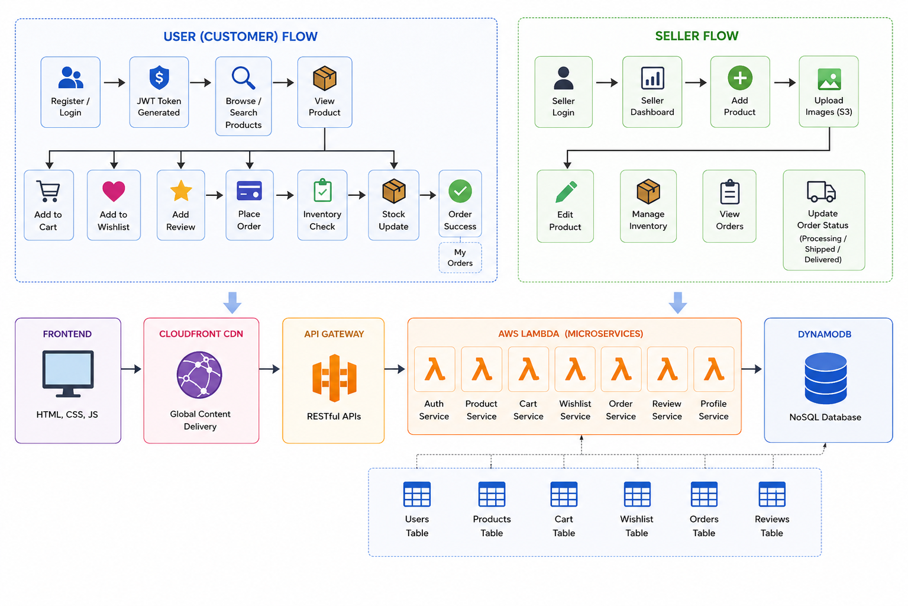

# 🛒 IDPShop — Serverless E-Commerce Platform

A fully serverless, highly-scalable e-commerce platform built on AWS microservices and modern frontend technologies.

---

## 📌 Project Overview

IDPShop is a comprehensive, cloud-native application designed to provide a robust shopping experience:
- **Customers** can browse, search, manage their carts/wishlists, and place orders securely.
- **Sellers** have access to a dedicated dashboard to manage products, inventory, and order fulfillment.
- **Backend APIs** are entirely serverless, powered by AWS Lambda and orchestrated by API Gateway.
- **Database** operations rely on DynamoDB for high-throughput NoSQL storage.
- **Frontend** assets are served globally via AWS S3 and CloudFront CDN.

---

## 🏗️ Architecture Design



### User (Customer) Flow:
1. Register/Login (JWT Token Generated)
2. Browse/Search Products 
3. View Product → Add to Cart / Wishlist / Review
4. Place Order → Inventory/Stock Update
5. Order Success

### Seller Flow:
1. Login to Seller Dashboard
2. Add/Edit Products and Upload Images to S3
3. Manage Inventory & Stock
4. View and Update Order Statuses (Processing → Shipped → Delivered)

---

## 🚀 Key Features

### 👤 Customer Features
- **Authentication**: Secure JWT-based registration and login.
- **Catalog**: Dynamic product browsing, search, and detailed views.
- **Cart & Wishlist**: Persistent cart and wishlist management.
- **Checkout**: Seamless order placement with real-time stock checks and profile validation.
- **Orders**: Tracking order history and status.
- **Reviews**: Ability to rate and review purchased products.

### 🛍️ Seller Features
- **Dashboard**: Centralized hub for metrics and operations.
- **Product Management**: Create, edit, and categorize products with image uploads.
- **Inventory Control**: Real-time stock tracking with "Low Stock" and "Out of Stock" alerts.
- **Order Fulfillment**: Track incoming orders and update delivery statuses.

---

## ☁️ AWS Services Stack

| Service | Purpose |
|---|---|
| **AWS Lambda** | Isolated backend microservices (Auth, Product, Cart, Wishlist, Order, Review, Profile). |
| **API Gateway** | RESTful API routing and management. |
| **DynamoDB** | Fully managed NoSQL database for structured data storage. |
| **Amazon S3** | Static website hosting and persistent product image storage. |
| **CloudFront** | Global Content Delivery Network (CDN) for fast asset serving. |

---

## 📂 Project Structure

```text
idpshop/
├── .github/workflows/    # CI pipelines (GitHub Actions)
├── backend/              # AWS Lambda microservices
│   ├── auth/             # Login, Registration & JWT handlers
│   ├── cart/             # Cart operations
│   ├── orders/           # Order placement & fulfillment logic
│   ├── product/          # Browsing and Search logic
│   ├── profile/          # User profile operations
│   ├── review/           # Product rating & review handlers
│   ├── seller/           # Seller-specific restricted endpoints
│   ├── tests/            # Zero-dependency Pytest unit testing suite
│   └── wishlist/         # Wishlist operations
├── frontend/             # Static Web Assets
│   ├── css/              # Global & modular styling
│   ├── js/               # API clients, authentication, & page logic
│   ├── pages/            # HTML Views (Auth, Customer, Seller)
│   └── public/           # Logos & static icons
├── terraform/            # Infrastructure as Code (IaC)
└── architecture.png      # System architecture diagram
```

---

## 🤖 Continuous Integration (CI)

This repository implements a **Continuous Integration (CI)** pipeline via **GitHub Actions** (`.github/workflows/ci.yml`) to ensure high code quality and infrastructure integrity. 

**Note: This is a CI-only workflow. It does NOT automatically deploy to production.**

### Pipeline Tasks (Triggered on `git push`):
1. ✅ **Checkout Code**: Retrieves the latest commit.
2. ✅ **Setup Python 3.12**: Provisions the runtime environment.
3. ✅ **Install Dependencies**: Installs required libraries (`boto3`, `pyjwt`, `bcrypt`).
4. ✅ **Python Syntax Check**: Validates syntax across all `backend/**/*.py` files.
5. ✅ **Terraform Setup & Init**: Prepares the HashiCorp Terraform environment.
6. ✅ **Terraform Validate**: Ensures all IaC configuration files are structurally correct.

### Benefits
- Catches logic and syntax errors early.
- Enforces professional development workflows.
- Prevents breaking infrastructure configurations from being merged.
- Mitigates the risk of unintended automatic deployments to live AWS environments.

---

*Developed for the IDPShop E-Commerce Initiative.*